<h2 align="center">✈️ FlightVault: Time-Travel Database for Aviation Data</h2>

<h3 align="center">Visual Disaster Recovery Tool using MariaDB System-Versioned Tables</h3>

<p align="center"><b>FlightVault</b> transforms database disasters from hours-long crises into seconds-long fixes through visual time-travel and intelligent recovery algorithms. Built for aviation databases, it provides complete temporal tracking, smart restore point detection, and surgical data recovery capabilities.</p>

<p align="center"><em>Submitted by Team FyreBird</em></p><br>

<div align="center"> 
  
  [](https://python.org)
  [](https://fastapi.tiangolo.com)
  [](https://nextjs.org)
  [](https://typescriptlang.org)
  [](https://mariadb.org)
  [](https://docker.com)
  
  [](https://opensource.org/licenses/MIT)
  [](http://makeapullrequest.com)
  
</div>
<br>

<div align="center">

> Visual disaster recovery tool using MariaDB System-Versioned Tables

</div>
<br>

### Demonstrations

**📸 [View Screenshots](SCREENSHOTS.md)** - Interface overview and feature demonstrations<br>
**🔴 [Watch Full Demo on YouTube](https://youtu.be/XXW_1QKWpnc)** - Complete walkthrough of FlightVault's disaster recovery capabilities <br>


<div align="center">
  <a href="https://youtu.be/XXW_1QKWpnc">
    
  </a>
</div>

**Local Demo Videos Available:**
- `assets/Video/flightvault_cli.mp4` - CLI Interface Demo
- `assets/Video/flightvault_web.mp4` - Web Interface Demo
<br>

### ⚡ Quick Start

```bash
# Quick Start (Manual)
pip install -r requirements.txt
python setup/database_setup.py
python setup/data_loader.py
python start_api.py       # API: http://localhost:8000
cd frontend && npm install && npm run dev   # UI: http://localhost:3000
```

## Table of Contents

- [🎯 Features](#features)
- [🏗️ Architecture](#architecture)
- [⚡ Quick Start](#setup-instructions)
  - [Docker Setup](#using-docker-recommended)
  - [Manual Setup](#manual-setup)
- [⚙️ Configuration](#configuration)
- [💻 Usage](#usage)
  - [Command Line Interface](#command-line-interface)
  - [Web Interface](#web-interface)
- [🧠 Technical Innovation](#technical-innovation)
  - [Smart Restore Algorithm](#smart-restore-point-algorithm)
  - [System-Versioned Tables](#system-versioned-tables)
- [🎬 Demo Scenario](#demo-scenario)
- [🔧 Development](#development)
- [🚀 Future Enhancements](#future-enhancements)
- [📄 License](#license)

## Features

- Visual timeline explorer for database history navigation
- Smart diff viewer with color-coded change comparisons
- Intelligent restore point detection using binary search algorithms
- Selective restore for surgical data recovery
- Professional CLI for automation and scripting
- Modern web interface with real-time updates
- Docker deployment support

## Architecture

```mermaid
flowchart LR
  %% Styling
  classDef ui fill:#111827,stroke:#374151,stroke-width:1px,color:#F9FAFB;
  classDef api fill:#0EA5E9,stroke:#075985,stroke-width:1px,color:#FFFFFF;
  classDef core fill:#10B981,stroke:#065F46,stroke-width:1px,color:#FFFFFF;
  classDef db fill:#334155,stroke:#0F172A,stroke-width:1px,color:#E2E8F0;
  classDef svc fill:#6366F1,stroke:#312E81,stroke-width:1px,color:#EEF2FF;
  classDef ext fill:#F59E0B,stroke:#92400E,stroke-width:1px,color:#111827;

  %% Client
  User[User]:::ui --> UI[Next.js Web UI<br/>Timeline • Diff • Restore]:::ui
  User --> CLI[Python CLI<br/>status • timeline • diff • recover]:::ui

  %% API Layer
  UI -->|HTTP/JSON| API[(FastAPI REST API<br/>/health /timeline /diff /suggest-restore /restore)]:::api
  CLI -->|Local or HTTP| API

  %% Core Services
  API --> TE[Temporal Engine<br/>FOR SYSTEM_TIME AS OF]:::core
  API --> ALG[Smart Restore Algorithm<br/>Binary Search + Health Score]:::core
  API --> REST[Recovery Executor<br/>Dry-run • Transactional Restore]:::core
  API --> DIFF[Diff Analyzer<br/>Added • Deleted • Modified]:::core

  %% Database
  TE --> DB[(MariaDB 11<br/>System-Versioned Tables<br/>WITH SYSTEM VERSIONING)]:::db
  ALG --> DB
  REST --> DB
  DIFF --> DB

  %% Data Source
  OF[OpenFlights Dataset<br/>airports • airlines • routes]:::ext -->|load| DB

  %% Optional Infra
  subgraph Optional
    CORS[CORS and Auth future]:::svc
    Docker[Docker Compose<br/>mariadb • api • ui]:::svc
  end
  CORS -.-> API
  Docker -. orchestrates .- API
  Docker -. orchestrates .- DB
  Docker -. orchestrates .- UI
```



This project demonstrates integration between:
- **MariaDB System-Versioned Tables** for temporal data storage with automatic history tracking
- **Python** for backend processing: temporal queries, smart algorithms, and recovery operations:
    - [FastAPI](https://github.com/tiangolo/fastapi) for REST API backend
    - [mariadb](https://github.com/mariadb-corporation/mariadb-connector-python) for database connectivity
    - Custom binary search algorithms for optimal restore point detection
    - Health scoring system for data integrity validation
- **Next.js** for modern frontend with TypeScript and Tailwind CSS
- **Docker** for containerized deployment and development

## Implementation

The system implements a complete disaster recovery workflow for aviation databases containing airports, airlines, and routes data from OpenFlights.

### 1. Temporal Data Engine

See the main business logic for temporal operations under `src/core/temporal_engine.py`

1. **System-Versioned Tables**: Automatic tracking of all data changes with timestamps
2. **Temporal Queries**: Query data state at any point in time using `FOR SYSTEM_TIME AS OF`
3. **Audit Trail**: Complete history of all database modifications
4. **Diff Calculation**: Compare data states between different timestamps

### 2. Smart Restore Algorithm

See the intelligent recovery logic under `src/algorithms/smart_restore_algorithm.py`

- **Binary Search**: Efficiently locate disaster boundaries in temporal history
- **Health Scoring**: Multi-factor validation of data integrity at each timestamp
- **Confidence Calculation**: Statistical confidence in restore point selection
- **Boundary Detection**: Precise identification of corruption start time

### 3. Recovery Operations

See `src/core/selective_restore.py` for surgical recovery implementation

- **Full Restore**: Complete database restoration to a specific timestamp
- **Selective Restore**: Surgical recovery preserving legitimate changes
- **Preview Mode**: Dry-run capability to preview recovery impact
- **Dependency Validation**: Foreign key integrity checks before restoration

### 4. User Interfaces

- **Web Interface**: Modern Next.js frontend with timeline visualization
- **CLI Tool**: Professional command-line interface for automation
- **REST API**: Complete API for integration with external systems

## Setup Instructions

- Python 3.11+
- MariaDB 11.0+ (with System Versioning support)
- Node.js 18+ (for frontend)
- Docker and Docker Compose (optional, for containerized setup)

### Using Docker (Recommended)

1. Clone and start the application:
   ```bash
   git clone https://github.com/AvishkarPatil/FlightVault.git
   cd FlightVault
   docker-compose up -d
   ```

2. Load sample aviation data:
   ```bash
   docker-compose exec flightvault python setup/data_loader.py
   ```

3. The application will be available at:
   - Web Interface: http://localhost:8000
   - API Documentation: http://localhost:8000/docs

### Manual Setup

1. Install Python dependencies:
   ```bash
   pip install -r requirements.txt
   ```

2. Setup MariaDB database:
   ```bash
   python setup/database_setup.py
   ```

3. Load aviation data:
   ```bash
   python setup/data_loader.py
   ```

4. Start the API server:
   ```bash
   python start_api.py
   ```

5. Start the frontend (separate terminal):
   ```bash
   cd frontend
   npm install
   npm run dev
   ```

## Configuration

The application can be configured using environment variables:

| Variable | Description | Default |
|----------|-------------|---------|
| DB_USER | Database username | root |
| DB_PASSWORD | Database password | password |
| DB_HOST | Database hostname | localhost |
| DB_PORT | Database port | 3306 |
| DB_NAME | Database name | flightvault |

## Usage

### Command Line Interface

The CLI provides comprehensive disaster recovery operations:

```bash
# System status and health check
python src/cli/flightvault.py status

# View timeline of database changes
python src/cli/flightvault.py timeline --hours 24

# Compare database states between timestamps
python src/cli/flightvault.py diff --timestamp "2024-01-01T12:00:00"

# Preview recovery without making changes
python src/cli/flightvault.py recover --dry-run

# Execute full database recovery
python src/cli/flightvault.py recover --execute

# Selective restore with surgical precision
python src/cli/flightvault.py selective

# Show smart algorithm analysis
python src/cli/flightvault.py algorithm
```

**📖 [View Detailed CLI Commands](CLI_COMMANDS.md)** - Complete command reference with parameters and examples

### Web Interface

The web interface provides intuitive disaster recovery with:
- Interactive timeline slider for temporal navigation
- Visual diff viewer for change comparison
- One-click recovery with confidence scoring
- Real-time activity monitoring

## Technical Innovation

### Smart Restore Point Algorithm

**Core Innovation**: Binary search through temporal history with intelligent health scoring

1. **Search Window**: Configurable time window (default: 24 hours)
2. **Binary Search**: O(log n) efficiency for disaster boundary detection
3. **Health Validation**: Multi-factor scoring system:
   - Record count validation
   - Required field integrity checks
   - Foreign key relationship validation
   - Data distribution analysis
4. **Boundary Detection**: Precise identification of corruption onset
5. **Confidence Scoring**: Statistical confidence in selection accuracy

### System-Versioned Tables

- **Automatic History**: MariaDB tracks all changes without application code
- **Point-in-Time Recovery**: Query exact database state at any timestamp
- **Zero Overhead**: Minimal performance impact on normal operations
- **ACID Compliance**: Full transactional integrity for recovery operations

## Development

This project uses a modular architecture with clear separation of concerns:

- `src/algorithms`: Smart recovery algorithms and health scoring
- `src/core`: Temporal engine and selective restore operations
- `src/api`: FastAPI REST API endpoints
- `src/cli`: Command-line interface implementation
- `frontend`: Next.js web application with TypeScript
- `setup`: Database initialization and data loading scripts

## Demo Scenario

**The Crisis**: Mumbai Airport Database Disaster at 2 AM

> 📖 **[View Complete Demo Scenario](DEMO_SCENARIO.md)** - A detailed walkthrough of FlightVault's disaster recovery capabilities

**Quick Summary:**
- **Crisis**: Junior developer accidentally deletes 9 Mumbai airports
- **Impact**: 156 flight routes broken, $8,000/minute in losses
- **Traditional Recovery**: 150+ minutes, $880,000+ lost
- **FlightVault Recovery**: 3 minutes, $400 lost
- **Result**: 50x faster recovery, 2,200x less financial damage

**The Recovery Process:**
1. **Instant Detection** (1 second) - MariaDB temporal tables capture changes
2. **Smart Analysis** (2.3 seconds) - Binary search finds optimal restore point  
3. **Visual Time-Travel** (45 seconds) - Drag timeline to see exact changes
4. **One-Click Recovery** (0.8 seconds) - Restore 9 airports and fix 156 routes

**Key Innovation**: Binary search through 24 hours of database history in 8 iterations with 98.7% confidence scoring.ty = 'Mumbai';
-- 2 airports deleted, affecting 156 routes


**The Recovery**:
1. Timeline visualization shows disaster spike at 14:32:15
2. Smart algorithm analyzes 1,440 minutes in 8 binary search iterations
3. Optimal restore point identified: 14:31:45 (98% confidence)
4. One-click recovery restores 2 airports and fixes 156 routes
5. Total recovery time: 0.8 seconds


## Future Enhancements

**Planned features for production deployment:**

- **Multi-Table Cascade**: Coordinated restoration across related tables with dependency management
- **Analytics Dashboard**: Historical trend analysis, disaster patterns, and recovery insights
- **Real-time Monitoring**: Automatic disaster detection with configurable alerts and notifications
- **Cloud Deployment**: Native AWS/Azure/GCP integration with managed database services
- **RBAC Security**: Role-based access control for team environments and audit compliance
- **Mobile Interface**: iOS/Android disaster recovery apps for on-the-go database management
- **Advanced Algorithms**: Machine learning-powered anomaly detection and predictive recovery
- **Multi-Database Support**: PostgreSQL, MySQL, and other temporal database implementations

**Community contributions welcome!**

## Troubleshooting

**Connection refused** → Ensure MariaDB running, check `DB_HOST`/`DB_PORT`, run `docker-compose ps`

## License

This project is licensed under the MIT License - a permissive license that allows commercial and non-commercial use with attribution.

Copyright (c) 2025 Avishkar Patil

Permission is hereby granted, free of charge, to any person obtaining a copy of this software and associated documentation files (the "Software"), to deal in the Software without restriction, including without limitation the rights to use, copy, modify, merge, publish, distribute, sublicense, and/or sell copies of the Software, and to permit persons to whom the Software is furnished to do so, subject to the following conditions:

The above copyright notice and this permission notice shall be included in all copies or substantial portions of the Software.

THE SOFTWARE IS PROVIDED "AS IS", WITHOUT WARRANTY OF ANY KIND, EXPRESS OR IMPLIED, INCLUDING BUT NOT LIMITED TO THE WARRANTIES OF MERCHANTABILITY, FITNESS FOR A PARTICULAR PURPOSE AND NONINFRINGEMENT. IN NO EVENT SHALL THE AUTHORS OR COPYRIGHT HOLDERS BE LIABLE FOR ANY CLAIM, DAMAGES OR OTHER LIABILITY, WHETHER IN AN ACTION OF CONTRACT, TORT OR OTHERWISE, ARISING FROM, OUT OF OR IN CONNECTION WITH THE SOFTWARE OR THE USE OR OTHER DEALINGS IN THE SOFTWARE.

---

<div align="center">
  <small><em>FlightVault: When disasters strike, recovery takes flight.</em> ✈️</small>
</div>
